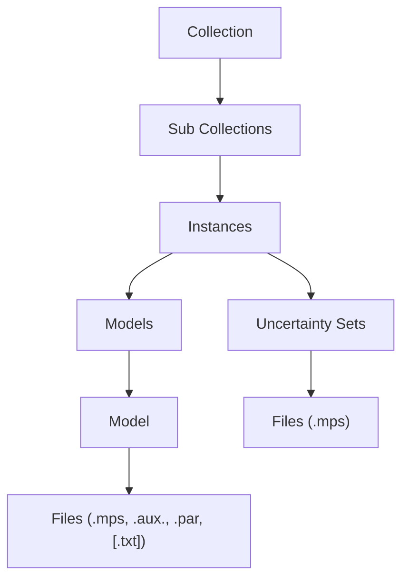
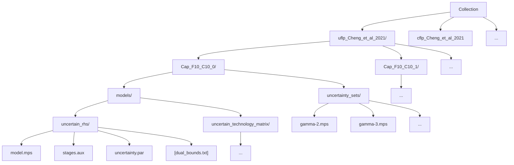

# Robust Instances

This folder contains robust problem instances and is organized as follows.

```mermaid
    flowchart TD
    
    _Collection[Collection] --> _SubCollection["Sub Collections"] --> _Instances["Instances"]
    _Instances --> _Models["Models"] --> _Model["Model"] --> _ModelFiles["Files (.mps, .aux., .par, [.txt])"]
    _Instances --> _UncertaintySets["Uncertainty Sets"] --> _UncertaintySetFiles["Files (.mps)"]
    
```

For instance, here is how instances from the `uflp_Cheng_et_al_2021` sub-collection are organized.

```mermaid
    flowchart TD
        
    Collection
    
    Collection --> uflp_Cheng_et_al_2021["uflp_Cheng_et_al_2021/"]
    Collection --> cflp_Cheng_et_al_2021
    Collection --> dots[...]
    
    uflp_Cheng_et_al_2021 --> Cap_F10_C10_0["Cap_F10_C10_0/"]
    uflp_Cheng_et_al_2021 --> Cap_F10_C10_1["Cap_F10_C10_1/"]
    uflp_Cheng_et_al_2021 --> dots2[...]

    Cap_F10_C10_0 --> models["models/"]
    Cap_F10_C10_0 --> uncertainty_sets["uncertainty_sets/"]
    Cap_F10_C10_1 --> dots5[...]
    
    models --> uncertain_rhs["uncertain_rhs/"]
    uncertain_rhs --> model.mps
    uncertain_rhs --> stages.aux
    uncertain_rhs --> uncertainty.par
    uncertain_rhs --> _["[dual_bounds.txt]"]
    
    models --> uncertain_technology_matrix["uncertain_technology_matrix/"] --> dots3[...]

    uncertainty_sets --> gamma-2.mps
    uncertainty_sets --> gamma-3.mps
    uncertainty_sets --> dots4["..."]
```
